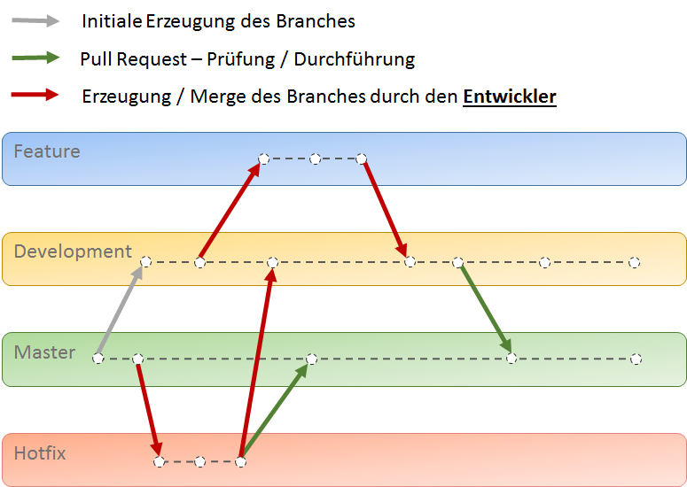
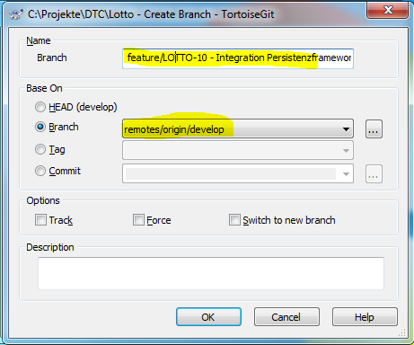

# Lotto
Mit diesem Beispielprojekt sollen folgende Technologien näher angeschaut werden:

* angular.io
* REST Client API
* docker
* docker compose
* kafka
* GIT
* Java ab Version 8
* Orika Mapper
* Gradle
* Jenkins
* Openshift
* Dropwizard
* NoSQL (MongoDb)
* Maria DB

# Versionsverwaltung - Umgang mit GIT
Folgendes Bild beschreibt die Arbeitsweise mit GIT in diesem Projekt:



## Einrichtung & Konventionen
Es gelten folgende Regeln für die Arbeit mit GIT:
1. Jeder Entwickler muss bei sich lokal den `develop` Branch auschecken.
  - Installieren von https://gitforwindows.org/	
  - Installieren von [GIT - Windows Shell Interface](https://tortoisegit.org/download/)
	(bei der Installation Pfad zur git.exe angeben... C:\Program Files\Git)
  - Nach der Installation auf der Kommando-Zeile folgenden Befehl ausführen `git config --global core.autocrlf false` -  Dieser Befehl sorgt dafür, dass beim Ein-/Auschecken der Dateien die Zeilenumbrüche nicht automatisch ins Windows-Format überführt werden. Weitere Infos dazu hier: https://git-scm.com/book/de/v1/Git-individuell-einrichten-Git-Konfiguration  
  - Anlegen eines Projektordners
  - Ausführen von `Git Clone`, um vom Remote-Repository ein lokales Abbild einzurichten
    - Auth-Daten zu individuellem Git-Konto
    - URL zum Remote-Repo (individuelles Git-Konto muss eingerichtet - also hinzugefügt und berechtigt - sein)
    - bei Problemen zuerst prüfen, ob Proxy korrekt in den Git-Settings eingerichet ist (etwa `http://proxy.domain.tld:3128` - auch für https)
  - Ausführen von `Git Switch`, um vom `master` zum `develop` zu wechseln
2. Die Entwicklung einer Aufgabe erfolgt immer in einem Feature.
  - Der Feature-Branch ist immer von `remotes/origin/develop` abzuleiten
  - Als Name ist folgendes Muster zu verwenden: `feature/Ticket - Aufgabe`, z.B. `feature/LOTTO-10 - Integration Persistenzframework`
  - Soll das Feature anderen Entwicklern zur Verfügung gestellt werden, so ist dieses in das Remote-Repository zu übertragen - mittels Push wie folgt: `remotes/origin/feature/Ticket - Aufgabe`, z.B.: `remotes/origin/feature/LOTTO-10 - Integration Persistenzframework` 
  - 
3. Nach Beendigung der Aufgabe mergt (`git push`) der Entwickler seine Arbeiten in den `remotes/origin/develop` Branch zurück und erstellt einen Pull-Request.

# Entwicklungsumgebung

## Eclipse
Das Backend kann mit [Eclipse Oxygen](http://www.eclipse.org/downloads/download.php?file=/technology/epp/downloads/release/oxygen/2/eclipse-java-oxygen-2-win32-x86_64.zip "Zum Download") oder auch mit [Visual Studio Code](https://code.visualstudio.com/download "Zum Download") entwickelt werden. Damit das Backend mit `Visual Studio Code` lauffähig ist muss [Java Extension Pack](https://code.visualstudio.com/docs/java/extensions "Zum Download") für VS Code installiert werden.

## Visual Studio Code
Das Frontend wird mit [Visual Studio Code](https://code.visualstudio.com/download "Zum Download") entwickelt.

### Extensions
Folgende Extensions, Packages und Tools sollten installiert werden:
* [Debugger for Chrome](https://marketplace.visualstudio.com/items?itemName=msjsdiag.debugger-for-chrome)
* [vscode-icons](https://marketplace.visualstudio.com/items?itemName=robertohuertasm.vscode-icons)
* [Java Extension Pack](https://marketplace.visualstudio.com/items?itemName=vscjava.vscode-java-pack)
* [TSLint](https://marketplace.visualstudio.com/items?itemName=eg2.tslint)

### Tools und Packages - Diese Installationsanleitung ist mangelhaft.
* [NodeJS](https://nodejs.org/dist/v9.4.0/node-v9.4.0-x64.msi)
* [Yarn](https://yarnpkg.com/latest.msi)

#### Konfiguration
Nach erfolgter Installation der Extensions und Tools bitte folgende Configuration durchführen.
* Windows 7 ggf. Proxy setzen - Terminalbefehle:
```cmd
yarn config set proxy http://proxy.domain.tld:3128
yarn config set https-proxy http://proxy.domain.tld:3128
npm config set proxy http://proxy.domain.tld:3128
npm config set https-proxy http://proxy.domain.tld:3128
```
* Prüfe darauf hin die Dateien `c:\Users\xxxx\.npmrc` und `c:\Users\xxxx\.yarnrc` bzw. `yarn config list`

### Global Packages:
Installation der Global Packages in der Solution. Hierfür das Root-Projektverzeichniss im VS-Code öffnen und über das Terminal-Fesnter folgende Befehle ausführen:
```cmd
 yarn global add tslint
 yarn global add typescript
 yarn global add @angular/cli
 yarn install #als letzer Befehl um die Packages zu installieren
```

## [Erstellen und Starten eines neuen Angular Projektes](neuesProjekt.md)

 ## [Cheatsheet der gängistens Angular cli Kommandos](https://cli.angular.io/reference.pdf)

# Backend - Durchstich
Als Backend-Durchstich dient zur Zeit ein kleiner REST Service. Dieses kann momentan wie folgt gestartet werden:
- im Eclipse: `LottoServices` Projekt im Eclipse importieren und dort `LottoApplication` Configuration ausführen
- im VS Code: Verzeichnis öffnen, `LottoApplication.java` im Editor öffnen und `F5` zum Start der Applikation drücken

Beim Starten der Applikation wird ein Jetty HTTP Server gestartet. Der Rest-Service ist unter folgender URL erreichbar:
- http://localhost:8080/lotto-service
- bzw. parametrisierbar, etwa http://localhost:8080/lotto-service?name=World

## Docker
Alle notwendige Infos zum Docker findest Du [hier](docker/README.md).
