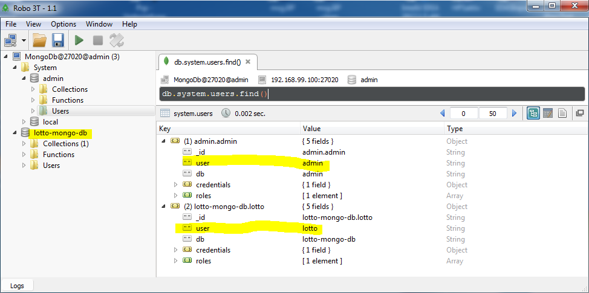

# Docker

## Installation von Docker unter Windows

1. [Docker Toolbox](https://github.com/docker/toolbox/releases) für Windows (aktuelle Version: `DockerToolbox-18.01.0-ce.exe`) runterladen und installieren. Sollte sich das Installationsprogramm "aufhängen", dann liegt es an der Proxy-Konfiguration. Lösungsansatz: Offline gehen, oder Internetverbindung ohne Proxy aufbauen und die Installation erneut probieren.

2. Diesen Schritt nur ausführen, falls Docker Toolbox mit Proxy genutzt wird. Ins Installationsverzeichnis gehen (i.d.R. `C:\Program Files\Docker Toolbox\`) und dort in der Datei `start.sh` ganz am Anfang die Proxy-Einstellungen eintragen:
```bash
#!/bin/bash

HTTP_PROXY="http://proxy.domain.tld:3128"
HTTPS_PROXY="http://proxy.domain.tld:3128"
...

```
3. Jetzt kann zum ersten Mal der `Docker Quickstart Terminal` gestartet werden (Start > Alle Programme > Docker > Docker Quickstart Terminal - Bei Windows 10 - Bitte als Administrator ausführen!). Bei diesem Start wird in der `Oracle VM VirtualBox` die Maschine `default` mit ggf. o.g. Proxy-Einstellungen angelegt. Sollten hier Probleme auftreten, dann gibt es folgendes Workaround:
 - Mit Schritt 5 weiter machen: In diesem Schritt wird die Maschine `default` ebenfalls angelegt, allerdings ohne Proxy!
 - `Oracle VM VirtualBox` starten und die `default` Maschine löschen
 - Mit Schritten 3 und 4 fortfahren

4. Die Verifikation der Installation kann durch den Befehl `docker run hello-world` in dem Docker Terminal nachvollzogen werden. Es ist dann erfolgreich, wenn es bei diesem Befehl keine Fehler auftreten.

5. Zur Verwaltung der Docker-Images und der Docker-Container kann auch das `Kitematic` - Tool genutzt werden (Start > Alle Programme > Docker > Kitematic). Sollte Kitematic mit Proxy-Einstellungen genutzt werden, dann bitte im Verzeichnis `C:\Program Files\Docker Toolbox\` folgendes Skript anlegen (`kitematic_proxy.cmd`), welches beim Start auch genutzt werden soll:       

```cmd
set proxyUrl=http://proxy.domain.tld:3128
SET HTTP_PROXY=%proxyUrl%
SET HTTPS_PROXY=%proxyUrl%
for /f %%i in ('docker-machine.exe ip default') do set DOCKER_HOST=%%i
SET NO_PROXY=%DOCKER_HOST%
set DOCKER_HOST=tcp://%DOCKER_HOST%:2376
cd Kitematic
Kitematic.exe
```

## MongoDB als Docker-Image/Container
1. `Docker Quickstart Terminal` starten
2. Im Terminal ins Docker Verzeichnis wechseln z.B.: `cd /c/Projekte/DTC/Lotto/docker`
3. `docker-compose up` - Befehl ausführen. Beim erstmaligen Start dieses Befehls wird ein entsprechendes docker-image erstellt und ein docker-container mit dem Namen `lotto-mongo-db` gestartet. In diesem Container wird die MongoDB-Instanz gestartet, welche wiederum beim erstmaligen Start die `lotto-mongo-db` Datenbank anlegt mit zwei Nutzern: Login: `admin`, Passwort: `admin` und Login: `lotto`, Passwort `lotto123`.
4. Folgende Informationen nutzen, um mit einem Client gegen die gestartete DB zu verbinden - Adresse: `192.168.99.100:27020`, Authentication - Database: `admin`, Login: `admin`, Passwort: `admin`
5. Das docker-container ist mit der Option `restart: always` eingerichtet, so das beim nächstmaligen Start des `Docker Quickstart Terminals` das entsprechende Container und somit auch die MongoDB automatisch gestartet werden.



Zm Zugriff auf die Datenbank bietet sich das Tool Robo 3T an - https://robomongo.org/download. 

## Import von CSV-Daten in MongoDB
csv-Daten können über den Befehl mongoimport (https://docs.mongodb.com/manual/reference/program/mongoimport) importiert werden.
Dazu ist das csv-File im Docker-Ordner (dort wo auch das Dockerfile liegt) bereitzustellen. Außerdem muss die Datei im Dockerfile registriert werden, zum Beispiel so:

```bash

ADD Praemien_CH.csv /Praemien_CH.csv

```

Wichtig ist, dass im csv als Trenner nur "," verwendet werden. In der ersten Zeile sind die Bezeichner der Spalten anzugeben. 
Hier ein Beispiel für die ersten drei Zeilen des csv:

```
Versicherer,Kanton,Hoheitsgebiet,Geschäftsjahr,Erhebungsjahr,Region,Altersklasse,Unfalleinschluss,Tarif,Tariftyp,Altersuntergruppe,Franchisestufe,Franchise,Prämie,isBaseP,isBaseF,Tarifbezeichnung
0008,AG,CH,2018,2017,PR-REG CH0,AKL-KIN,MIT-UNF,01_016_01200,TAR-HMO,K1,FRAST1,FRA-0,78.5,0,1,Centramed Zug
0008,AG,CH,2018,2017,PR-REG CH0,AKL-KIN,MIT-UNF,01_016_01200,TAR-HMO,K1,FRAST2,FRA-100,72.7,0,0,Centramed Zug
```

Der Importvorgang wird über eine Docker-Konsole mit folgendem Befehl gestartet:

```
mongoimport --db lotto-mongo-db --collection neos --username lotto --password "lotto123" --type csv --headerline
```
oder um sicherzustellen, dass keine Kommas im csv sind (vorher die Kommas in Zahlen durch Punkte ersetzen): 

```
tr "," "." < Praemien_CH.csv | tr ";" "," < Praemien_CH.csv | mongoimport --db lotto-mongo-db --collection neos --username lotto --password "lotto123" --type csv --headerline
```

Sollte die Collection (im Beispiel "neos") noch nicht vorhanden sein, so legt Mongo diese automatisch an. 
Über Robo 3T lassen sích die Daten zur Kontrolle selektieren, zum Beispiel mit:

```
db.getCollection('neos').find()
```
oder mit Parameter:
```
db.getCollection('neos').find({Kanton: 'AG', Franchisestufe:'FRAST5', Versicherer:8, Altersklasse:'AKL-ERW', Unfalleinschluss:'MIT-UNF'})
```

Im aktuellen Projekt wird der Import der Daten automatisch beim Start des Docker-Containers ausgeführt. 
Das heißt beim Start werden die DAten immer gelöscht und komplett neu importiert. Es werden 4 Collections angelegt:
- neo_preamien
- neo_regionen
- neo_wertebereiche
- neo_versicherungen

Dafür werden im Rootverzeichnis des Dockercontainers vier csv-Dateien erwartet:

- Praemien_CH.csv
- Wertebereiche_CH.csv
- Regionen_CH.csv
- Versicherungen_CH.csv

ACHTUNG: Bei Änderungen in den csv-Dateien muss vor dem Starten des Docker-Containers (docker-compose up) immer auch ein docker-compose build --force-rm ausgeführt werden.
 